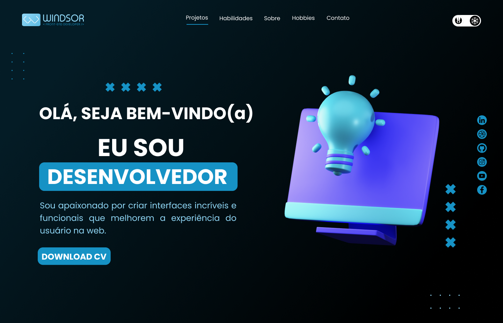

<h1 align="center"> Portfólio Windsor Dev </h1>

Meu Portfólio - HTML,CSS, JS

  <a href="#-tecnologias">Tecnologias</a>&nbsp;&nbsp;&nbsp;|&nbsp;&nbsp;&nbsp;
  <a href="#-projeto">Projeto</a>&nbsp;&nbsp;&nbsp;|&nbsp;&nbsp;&nbsp;
  <a href="#-layout">Layout</a>&nbsp;&nbsp;&nbsp;|&nbsp;&nbsp;&nbsp;
  <a href="#-demonstração">Demo</a>&nbsp;&nbsp;&nbsp;|&nbsp;&nbsp;&nbsp;
  <a href="#memo-licença">Licença</a>

  

 

  

## 🚀 Tecnologias

Esse projeto foi desenvolvido com as seguintes tecnologias:

- HTML,CSS e JavaScript
- Git e Github

## 💻 Projeto

Portfólio Windsor Dev

## 🔖 Layout

## :memo: Licença

Esse projeto está sob a licença MIT.

---

By Windsor S. Barbosa
